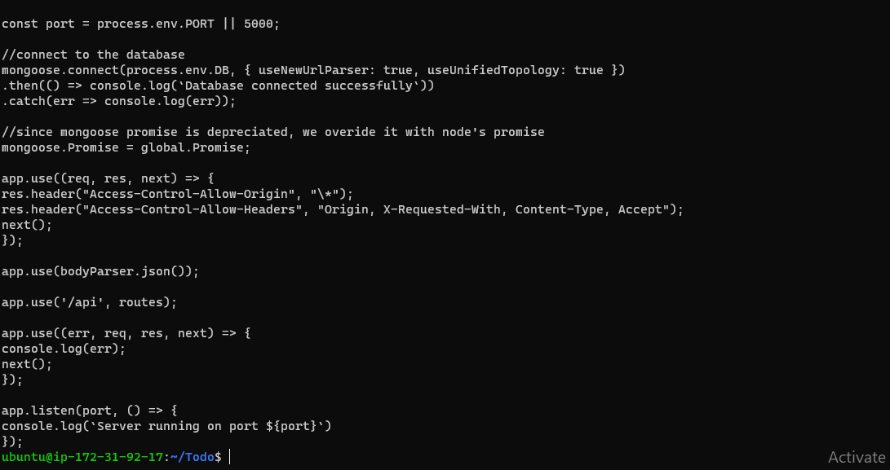

#STEP 1 – BACKEND CONFIGURATION

`sudo apt update`

`sudo apt upgrade`

`sudo apt-get install -y nodejs`

`node -v`

`npm -v `

`mkdir Todo`

`cd Todo`

`todo-ls`

#INSTALL EXPRESSJS

`npm install express`

#INSTALL EXPRESSJS

`touch index.js`

`npm install dotenv`

`vim index.js`

`node index.js`

`npm-install-mongoose`

#MODELS

`mkdir-todo-folder`

#MONGODB DATABASE

`node index`

